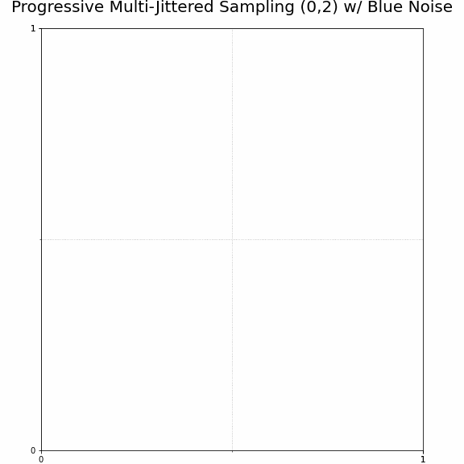

# C++ Implementation of Progressive Multi-Jittered Sample Sequences

This is an implementation of Progressive Multi-Jittered Sample Sequences (in 2D), based off two papers:

* [Progressive Multi-Jittered Sample Sequences (2018) by Christensen, Kensler, and Kilpatrick](https://graphics.pixar.com/library/ProgressiveMultiJitteredSampling/paper.pdf)
* [Efficient Generation of Points that Satisfy
Two-Dimensional Elementary Intervals (2019) by Matt Pharr](http://jcgt.org/published/0008/01/04/)

These sample sequences are really great for certain types of Monte Carlo integration problems, especially for use in computer graphics rendering. Here's one such sequence.

In addition to providing the code to generate these sample sequences, this repository also contains a number of the precomputed sequences that you could use directly in your own renderer, if you wish to skip the sample generation process. See the Sample Usage section for a little guidance on how to use them in your own renderer.

# License and Attribution

See the LICENSE.

# Sample Usage

There are really three sample sequences that are useful for rendering.

* pmj02, also known as Progressive Multi-Jittered Sequences (0,2). This sequence has extremely good convergence properties - for a given number of samples, it will typically have the lowest error. 
* pmjbn, also known as Progressive Multi-Jittered Sequences with Blue Noise (or best candidate sampling). This has the best "blue noise" characteristics, which has the nicest looking noise patterns to the human eye. This might be useful for camera rays, for example, especially if you're not using it in tandem with any denoising.
* pmj02bn, also known as Progressive Multi-Jittered Sequences (0,2) with Blue Noise.

# Generating Your Own Sample Sequences

# Code Usage

# Building

If you want to use this code simply to generate your own samples, see the section "Generating your own samples". You can build the sample generation using a simple "make release" command.

If you want to run the performance testing or error analysis code, you will need to install the [Bazel build tool](https://bazel.build/).

# Code Performance

Most likely, you'll want to use precomputed tables of these samples for optimal performance. See "Sample Usage". But a couple of notes on performance here:

* Because of Matt Pharr's optimization, the generation of pmj02 sequences is quite fast. On a single-thread on my 2017 Macbook Pro, I could generate 65536 samples in ~40ms, for approximately 1.65 million samples/sec.
* The best candidate sampling could most likely be a lot faster. The sample_generation/pmj.cc and sample_generation/pmj02.cc files use a constant 100 candidates per sample to generate high-quality samples, but this slows them down considerably. If you wanted to generate these samples during rendering, you'd want to use fewer candidates.
* The PMJ sequence is not well optimized. It linearly scans an array of strata, but the strata should be kept in a binary tree to be faster. Then again, there isn't much use for the PMJ sequence on its own, most likely you'd only want to use the PMJBN sequence, which you'd want to precompute to have the best blue-noise characteristics.